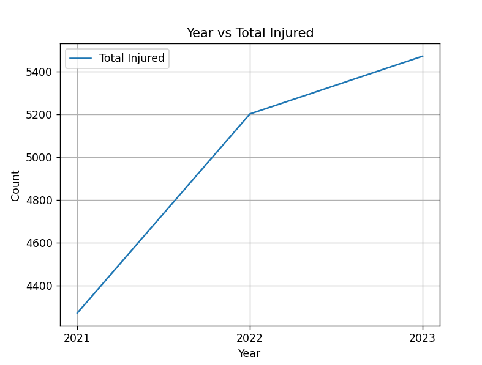
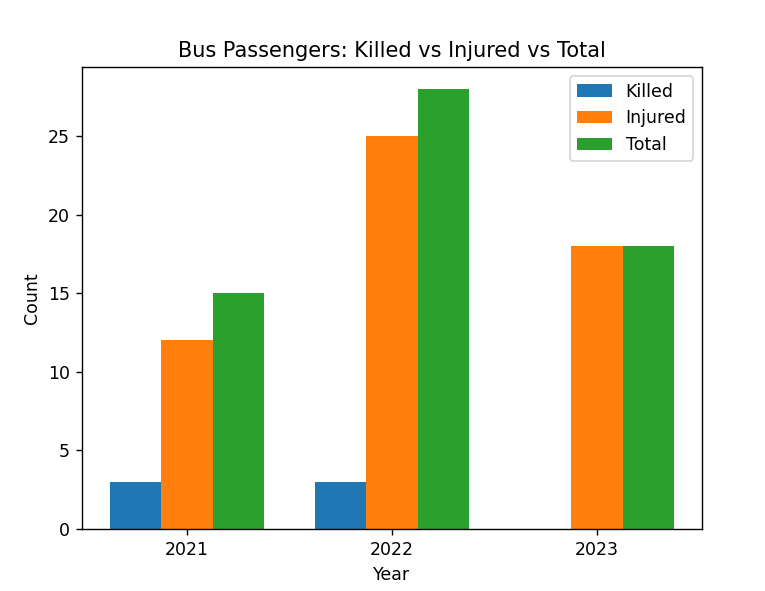
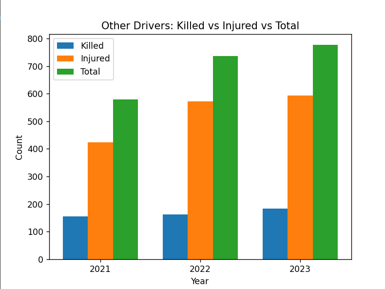
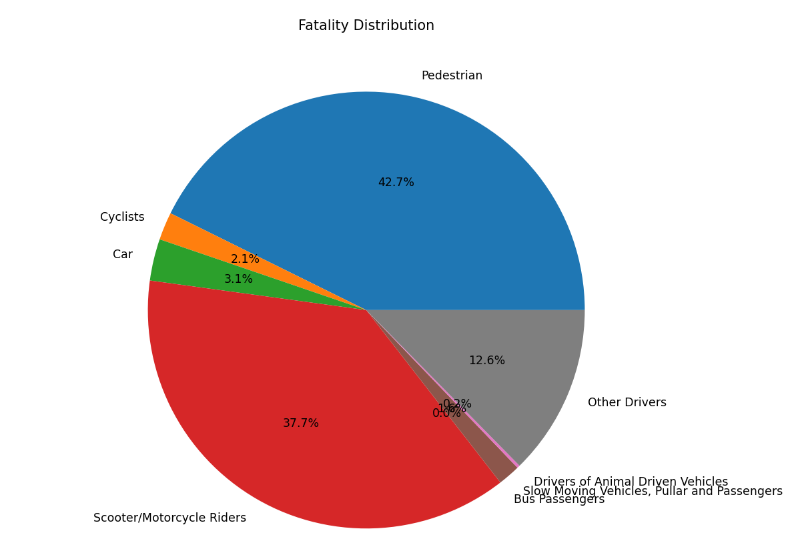
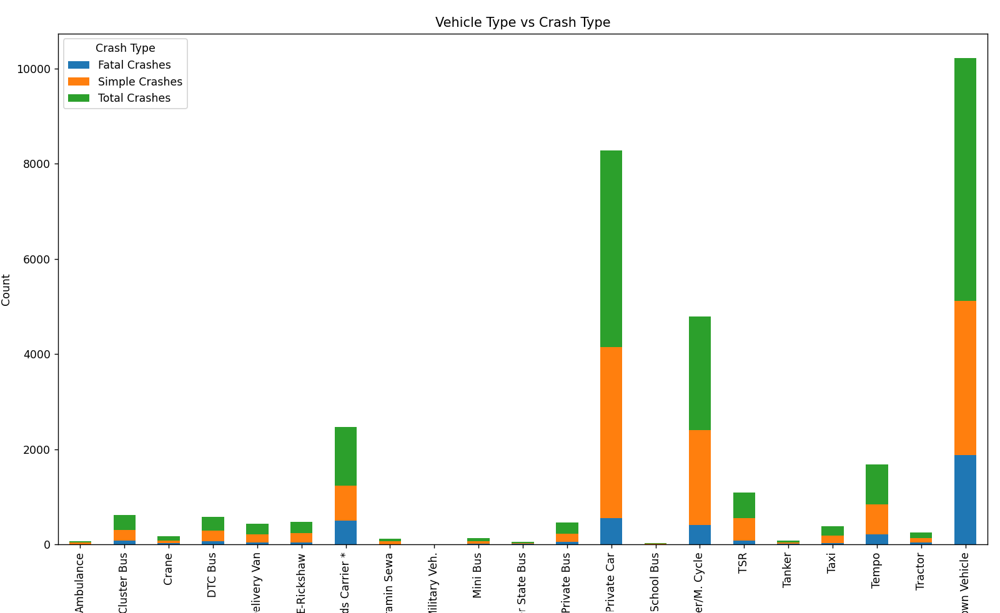
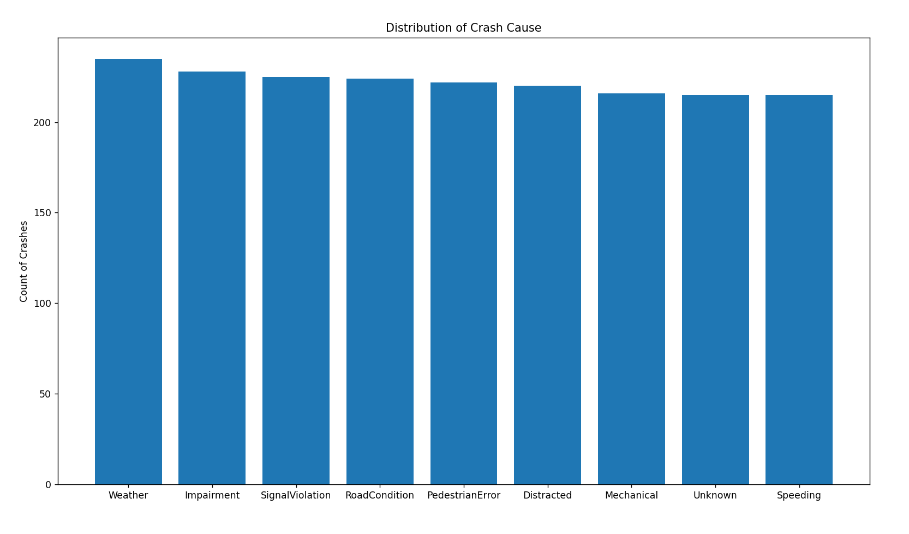
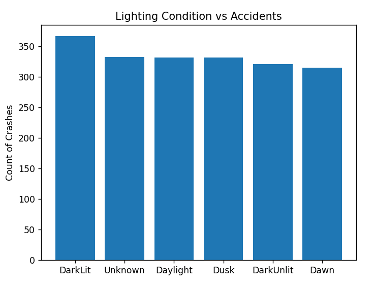
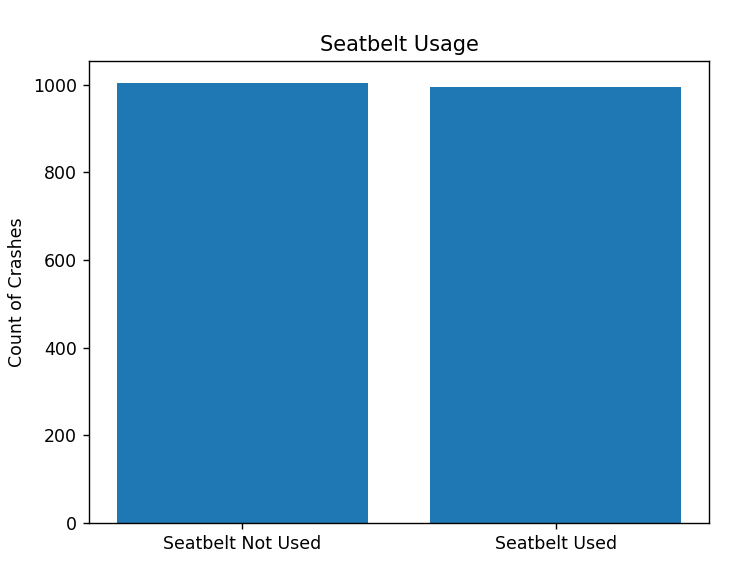

# **Analysis and Visualizations**

Analysis of the data and the resultant graphs was conducted to identify patterns, trends and contributing factors associated with traffic accidents.

## Year-wise Trend of Accidents

The analysis of yearly data shows that both fatalities and injuries peaked in 2022. While fatalities declined slightly in 2023, the number of injuries continued to increase at a slower rate, indicating a sustained level of accident severity over time

- ### Year Vs Total Killed

- ### Year Vs Total Injured

---

## Category-wise Analysis of Type of Road Users

Pedestrians and scooter/motorcycle riders were found to be the most vulnerable groups, accounting for a higher number of fatalities. Certain categories such as cyclists and bus passengers showed a decline in 2023, but most other categories remained relatively stable or experienced minor increases. Animal-driven vehicle incidents showed fluctuation, decreasing in 2022 and rising again in 2023.

- ### Pedestrian Injury Statistics

- ### Cyclists Injury Statistics

- ### Car Injury Statistics

- ### Scooter/Motorcyle Injury Statistics

- ### Bus Passenger Injury Statistics

- ### Animal-Driven Vehicle Passengers Injury Statistics

- ### Slow moving vehicles, Passengers Injury Statistics

- ### Other Passengers Injury Statistics

---

## Vehicle Type Analysis

Private cars, vehicles carrying goods and unidentified vehicle types contribute to the highest number of crashes. In contrast, specialized vehicles such as ambulances, military vehicles, and tankers are involved in significantly fewer accidents.

- ### Fatality Distribution

- ### Vehicle Type Vs Crash Type

---

## Feature Importance

Travel Speed and Weather Conditions are the most important factors in affecting the likelihood of crashes.

- ### Feature Importance

---

## Environmental Factors

Weather conditions such as haze and rain are associated with higher accident frequencies. In contrast, extreme weather conditions such as storms and fog show fewer recorded accidents, likely due to reduced road usage during such conditions.

- ### Distribution of Crash Causes

- ### Weather Condition Vs Accidents

---

## Lighting Conditions

A higher number of accidents occur during well lit night conditions compared to day or unlit conditions. This may be attributed to increased traffic volume during nighttime hours, whereas least accidents occur at dawn due to lower road activity.

- ### Lighting Condition Vs Accidents

---

## Behavioral Factors

Driver impairment and lack of seatbelt usage are associated with higher fatality risks. These factors significantly influence the severity of accidents and highlight the importance of enforcing traffic safety regulations.

- ### Driver Impairment

- ### Seatbelt Usage Vs Accidents

---

## Speed vs Fatality

The dataset does not show a strong relationship between speed and fatality rate. This may be due to limitations in the dataset rather than the absence of a real-world scenario.

- ### Speed Vs Fatalities

---

## Time-based Analysis

Accident frequency varies significantly with time of day. The highest number of accidents occurs during late afternoon hours around 15:00–16:00, which aligns with peak traffic conditions. The lowest number of accidents is observed during early afternoon hours.

- ### Accidents By Hour

---

## Post-Crash Care Analysis

The distribution of post-crash care time indicates that accident victims are almost equally likely to receive medical attention within shorter, moderate and longer time intervals. This shows that working improvements in emergency response systems is necessary.

- ### Post Crash Care Times

---
