# Visualizations

## 1. Year Vs Total Killed
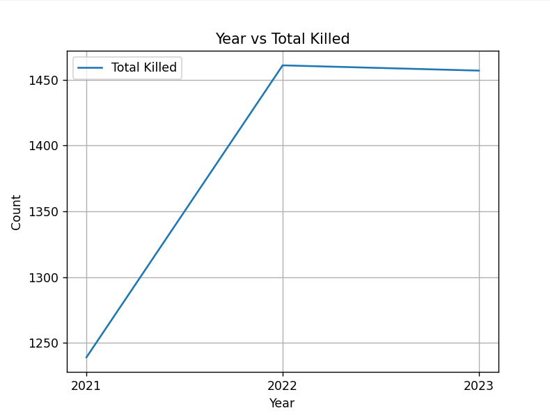

## 2. Year Vs Total Injured

## 3. Pedestrian Injury Statistics
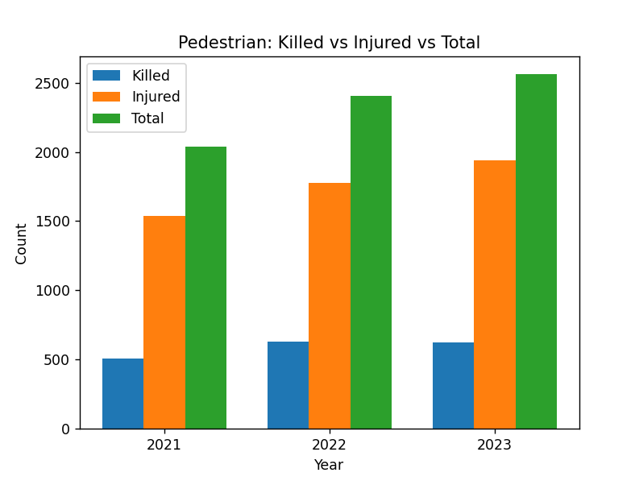

## 4. Cyclists Injury Statistics
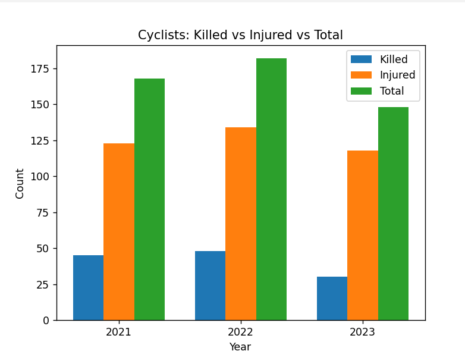

## 5. Car Injury Statistics
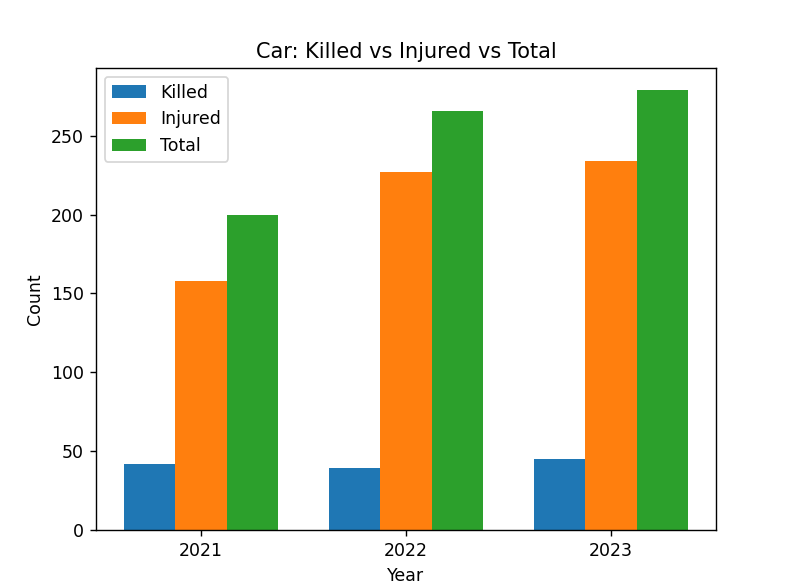

## 6. Scooter/Motorcyle Injury Statistics
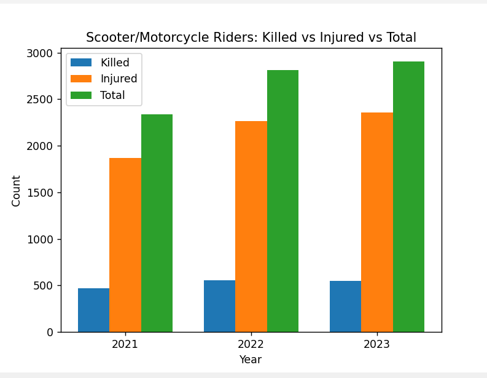

## 7. Bus Passenger Injury Statistics

## 8. Animal-Driven Vehicle Passengers Injury Statistics
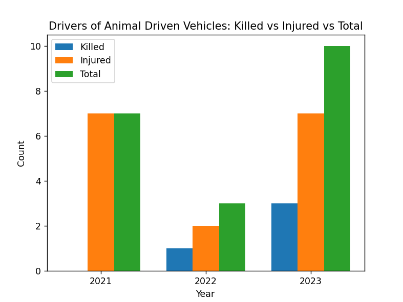

## 9. Slow moving vehicles, Passengers Injury Statistics
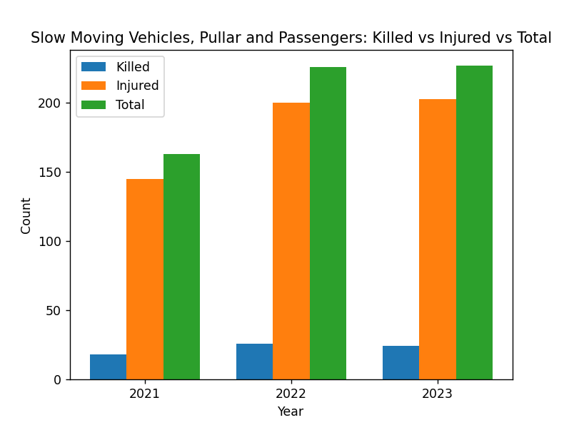

## 10. Other Passengers Injury Statistics

## 11. Fatality Distribution

## 12. Vehicle Type Vs Crash Type

## 13. Feature Importance
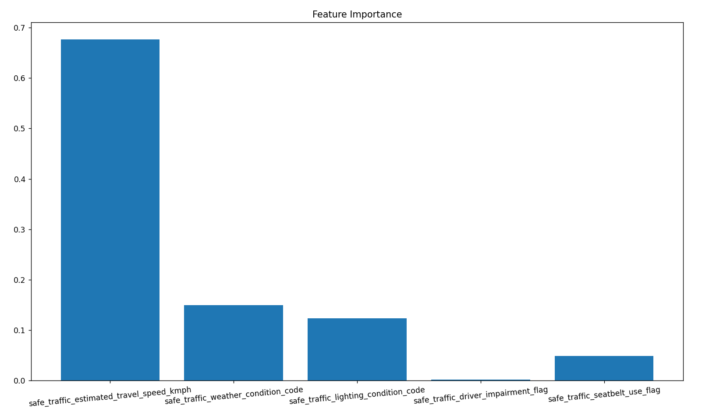

## 14. Distribution of Crash Causes

## 15. Lighting Condition Vs Accidents

## 16. Weather Condition Vs Accidents
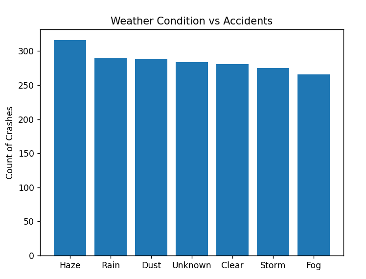

## 17. Seatbelt Usage Vs Accidents

## 18. Driver Impairment
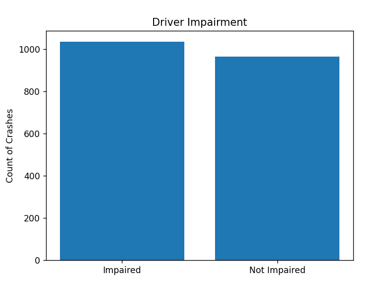

## 19. Speed Vs Fatalities
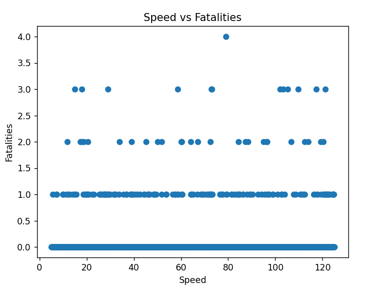

## 20. Accidents By Hour
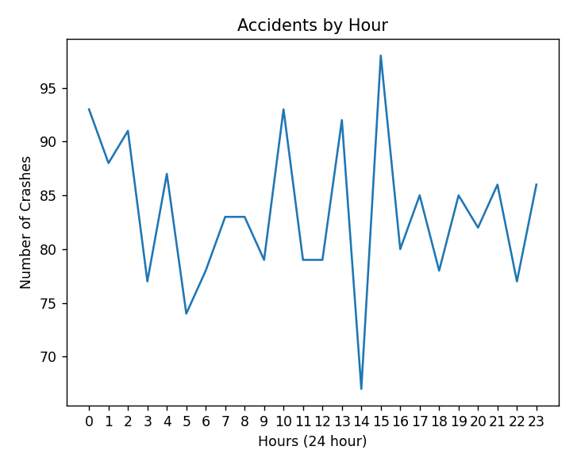

## 21. Post Crash Care Times
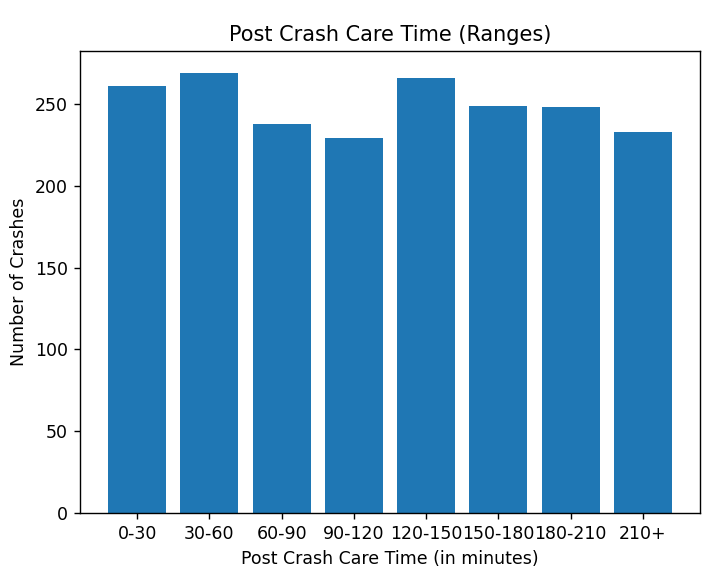

